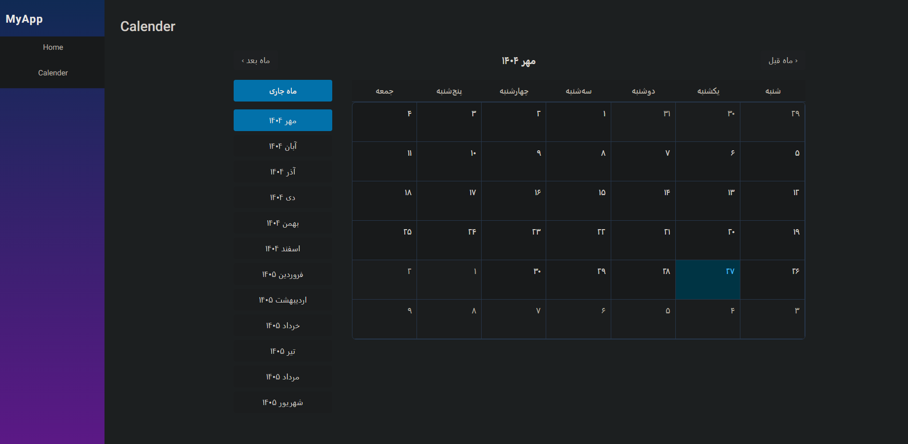

# Blazor Persian Calendar App

A modern Blazor WebAssembly application featuring a beautiful vertical navigation layout and a fully functional Persian (Jalali) calendar.

## Features
- **Vertical Sidebar Navigation** with active link highlighting
- **Persian Calendar** with month navigation and correct weekday alignment (Saturday as the first column)
- **Responsive and modern UI**
- **Persian month and year selection**
- **No external dependencies for calendar logic** (uses .NET's `PersianCalendar`)

## Project Structure
- `Pages/Calender.razor` — Main calendar page
- `Services/Calendars/PersianCalendarService.cs` — Persian calendar logic and utilities
- `Layout/MainLayout.razor` — Main layout with sidebar and top bar
- `SharedComponents/` — (Optional) Shared UI components

## Getting Started

### Prerequisites
- [.NET 9.0 SDK or later](https://dotnet.microsoft.com/download)

### Run the App
```bash
# Restore dependencies
 dotnet restore

# Build the project
 dotnet build

# Run the app (WebAssembly)
 dotnet run
```
Then open your browser and navigate to the URL shown in the terminal (usually `https://localhost:5001` or similar).

## Usage
- Use the sidebar to navigate between Home and Calendar.
- On the Calendar page, navigate months using the buttons or select a month from the list.
- The calendar grid starts with Saturday (شنبه) as the first column.

## Customization
- To add more pages, create new `.razor` files in the `Pages/` directory and add links in `MainLayout.razor`.
- To change the calendar logic, edit `PersianCalendarService.cs`.

## License
This project is for educational and demonstration purposes. 

## ScreenShot


